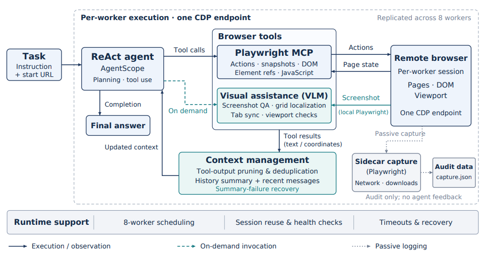

# web-agent

> 面向复杂网页任务的稳健型 Web Agent，结合结构化交互、视觉辅助、上下文管理与并发执行能力。

## 核心特性

- **结构化网页交互优先**：优先使用页面语义、无障碍快照、元素引用与 DOM 检查完成常规浏览器操作。
- **视觉理解与定位辅助**：当结构化页面信息不足时，按需调用截图分析与网格辅助坐标定位。
- **长任务上下文管理**：对工具输出进行裁剪和去重，压缩历史轨迹，并具备摘要失败恢复能力。
- **多进程并发与故障恢复**：为多个 CDP 浏览器端点启动独立 Worker，提供会话健康检查、有限重试与 Worker 恢复机制。

## 系统架构



每个 Worker 均运行一个基于 AgentScope 的 ReAct Agent。浏览器操作通过 Playwright MCP 完成，视觉辅助仅在需要时调用；上下文管理模块控制工具输出和交互历史的增长，运行时模块负责并发调度与故障恢复。

## 技术报告

详细技术方案见 [技术报告](技术报告.pdf)。

## 快速开始

### 1. 安装依赖

建议使用独立的 Conda 环境以保证环境可复现，但这不是强制要求。只要已有环境具备 Python 3.11、Node.js，以及 `environment.yml` 声明的依赖，也可以直接运行项目。

```bash
conda env create -f environment.yml
conda activate web-agent
```

### 2. 配置模型访问

在项目根目录创建 `config.json`，并妥善保管 API Key。最小配置示例：

```json
{
  "api_base": "https://your-api-base/v1",
  "api_key": "YOUR_API_KEY",
  "api_model": "YOUR_VISION_MODEL",
  "text_api_base": "https://your-api-base/v1",
  "text_api_key": "YOUR_API_KEY",
  "text_api_model": "YOUR_TEXT_MODEL"
}
```

### 3. 启动评测

```bash
bash scripts/run.sh <task_file> <output_dir> <cdp_url_1> [cdp_url_2 ...]
```

传入一个或多个远程浏览器 CDP 端点后，系统会为每个端点启动一个独立 Worker；评测场景下最多支持 8 个 Worker 并发执行。

## 项目结构

```text
web-agent/
├── web-agent-architecture.png  # 系统架构图
├── config.json             # 本地模型配置（请勿提交密钥）
├── environment.yml         # Conda 与 pip 依赖声明
├── scripts/run.sh          # 评测入口脚本
└── src/agent/
    ├── agent.py            # Agent 循环与工具编排
    ├── main.py             # 多进程任务调度
    ├── middlewares/        # 上下文、日志、超时和恢复支持
    ├── tools/              # 视觉与浏览器辅助工具
    └── web_controller.py   # 远程浏览器控制
```

每个任务会在指定输出目录下写入最终答案和审计产物，包括 `result.json`、`trajectory/` 与 `capture.json`。

## 评测结果

| 评测 | 设置 | 通过率 |
| --- | --- | --- |
| [WebRetriever 数据集](https://huggingface.co/datasets/Mininglamp-2718/WebRetriever) | Protocol 1 测试集 | **79%** |
| [WebRetriever Challenge](https://mininglamp-ai.github.io/WebRetriever_Challenge/?lang=zh) | Protocol 3 并发评测 | **59%** |

## 致谢与许可证

本项目面向复杂网页任务，涉及网页信息理解、多步交互、视觉定位、上下文管理与并发执行。项目基于 [AgentScope](https://github.com/agentscope-ai/agentscope) 和 [Playwright MCP](https://github.com/microsoft/playwright-mcp) 构建，并在 [WebRetriever](https://github.com/Mininglamp-AI/WebRetriever) 基准与挑战赛中进行评测。

许可证信息请见 [LICENSE](LICENSE)。
